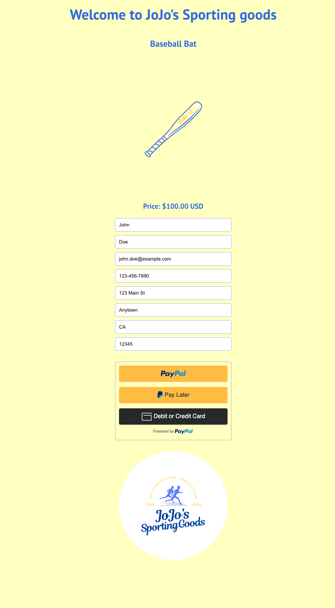

# Shopping Cart

## Table of Contents 
- [Description](#description) 
- [Installation](#installation)
- [Usage](#usage)
- [Testing](#testing)
- [Technologies](#technologies)
- [Contribution](#contribution)
- [Examples](#examples)
- [License](#license)
- [Questions](#questions)

## Description 
    A simple shopping cart application that utilizes the secure PayPal Express Checkout.  

## Installation 
To view and interact with the portfolio:

- Clone the repository.
- Install dependencies using `npm install`.
- Start the development server with `npm start`.

## Usage 
- Visit the deployed site at https://jojosportsshoppingcart.netlify.app. 

## Testing 
    Testing information to be added when developed.

## Technologies Used 

- React
- React Router
- React Bootstrap
- Netlify 
- Advanced Paypal Express Checkout

## Contribution

- PayPal Developer Docs: https://developer.paypal.com/sdk/js/reference/

## Examples  
 

## License 
    N/A

## Questions 
    For any questions, please contact [jovanna24](https://github.com/jovanna24) at jovannajimenez1124@gmail.com.
